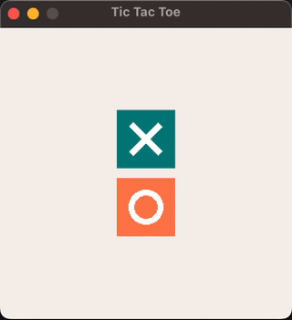

<a name="top"></a>
# Tic-Tac-Toe Game with Ruby 2D
This is a simple implementation of the classic Tic-Tac-Toe game using Ruby and the Ruby 2D library. It features a graphical interface where players can play against each other or against the computer.

## Table of Contents
- [Demo](#demo)
- [Setup](#setup)
- [How to Play](#how-to-play)
- [Code Structure](#code-structure)
- [License](#license)

## Demo


## Setup
To run this game, you need to have Ruby 3.4.3 installed. You can use a version manager like rbenv or RVM to install and manage Ruby versions.

Once you have Ruby 3.4.3 installed, navigate to the project directory and run the following command to install the gem Ruby 2D.

```zsh
bundle install
```

After that, you can start the game by running:

```zsh
ruby main.rb
```

## How to Play
When you start the game, you'll see a welcome screen with two buttons: one for X and one for O.
Click on the button corresponding to the player you want to be. For example, if you choose X, you will play as X, and the computer will play as O, and vice versa.
The game will then display a 3x3 grid. If it's your turn, you can make a move by clicking on an empty cell in the grid.
The computer will make its moves automatically when it's its turn.
The game ends when there's a winner or when the board is full (a draw). After a short delay, the game will return to the welcome screen, allowing the user to start a new game.

## Code Structure
The main game logic is encapsulated in the `Game` class, which manages the game state, including the board, players, and game status. It also handles the visual representation using Ruby 2D.

Key methods include:

- `make_move`: Places a mark on the board.
- `get_winner`: Checks if there's a winner or a draw.
- `minimax`: The algorithm used by the computer to evaluate board positions.
- `get_best_move_for`: Determines the best move for the computer player.

The UI is handled through Ruby2D's event handling and drawing functions. The game loop is managed using Ruby 2D's update block, which checks the game state and updates the display accordingly.

Note: While the Game class can theoretically support different grid sizes, the current UI implementation is specifically designed for a 3x3 grid.

## License
This project is open source and available under the [MIT](https://choosealicense.com/licenses/mit/) License.

##
[Back to top](#top)